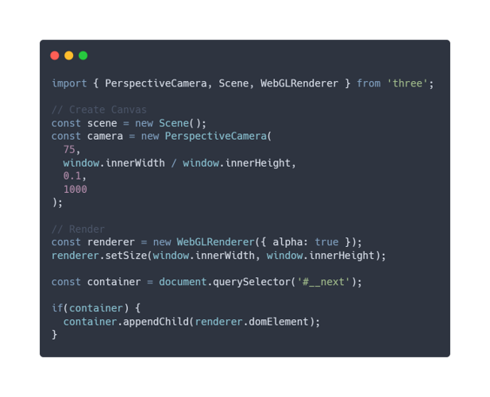

# Skill Pill - React Three Fiber and Three.js

## Table of contents 👇

- [✨ How to run the project](#-how-to-run-the-project)
- [🔧 Libraries](#-libraries)
- [🔥 Why we need to use R3F](#-why-we-need-to-use-R3F)

## ✨ How to run the project

1. Clone the project with `git clone`
2. Install dependencies with `npm install`
3. Run the project with `npm start`

## 🔧 Libraries

| Library            | command                                | documentation                                                                            |
| ------------------ | -------------------------------------- | ---------------------------------------------------------------------------------------- |
| React Three Fiber  | `npm install three @react-three/fiber` | [R3F Documentation](https://docs.pmnd.rs/react-three-fiber/getting-started/introduction) |
| React Three Drei   | `npm install @react-three/drei`        | [React Three Drei Documentation](https://github.com/pmndrs/drei)                         |
| React Three Cannon | `npm i @react-three/cannon`            | [React Three Cannon Documentation](https://github.com/pmndrs/use-cannon)                 |

## 🔥Why we need to use R3F

| With Three.js               | With React Three Fiber      |
| --------------------------- | --------------------------- |
|  |  |
